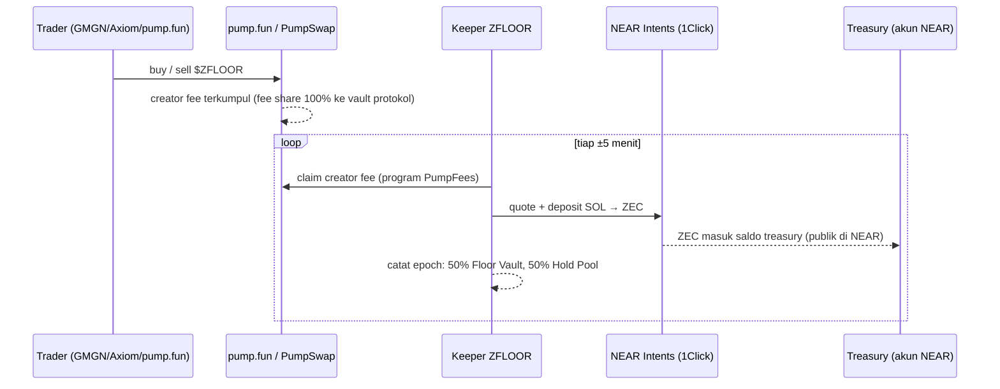
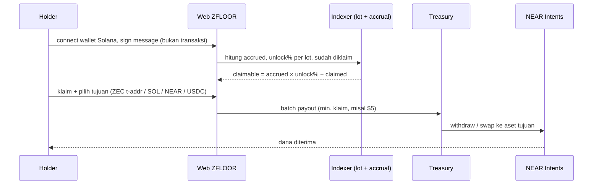
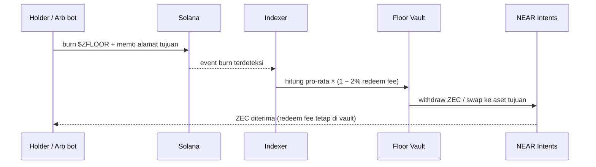

# ZFLOOR: ZEC-Backed Memecoin dengan Hard Floor + Hold-to-Unlock

> **One-liner:** Setiap trade di pump.fun menumpuk ZEC di treasury. Setengahnya jadi **hard floor** (burn-to-redeem), setengahnya jadi **reward ZEC yang unlock sesuai durasi hold**. Pump atau dump, $ZFLOOR tidak bisa ke nol, dan diamond hands dibayar oleh paper hands.

*Draft internal untuk tim · 27 Sep 2026 · nama token masih working name*

---

## 1. TL;DR

| | |
|---|---|
| **Launch** | pump.fun (Solana), 100% creator fee diarahkan ke vault protokol via fee sharing |
| **Konversi** | Creator fee (SOL) di-swap ke **ZEC** via **NEAR Intents 1Click** tiap ±5 menit |
| **Floor Vault (50%)** | Backing ZEC. Siapa pun bisa **burn $ZFLOOR → redeem ZEC pro-rata**. Membentuk hard floor harga |
| **Hold Pool (50%)** | ZEC di-accrue ke holder pro-rata saldo, **unlock sesuai durasi hold** (15m = 5% → 8j = 100%). Jual sebelum unlock berarti porsi yang belum unlock hangus ke pool |
| **Tanpa trading** | Protokol tidak trading dan tidak ada alpha risk. Semua nilai berasal dari creator fee |
| **Narasi** | ZEC (+90% bulan ini, NU7 5 Nov) × NEAR Intents (rail SOL→ZEC) × memecoin "can't go to zero" |

---

## 2. Masalah yang kita selesaikan

1. **Memecoin biasa: dump berarti nol.** Holder yang nyangkut tidak punya exit.
2. **Model "fee dibagi ke holder" (nearpad, NEARKAT/StonkFun) sudah basi.** Reward-nya receh dan tanpa syarat, jadi yang datang cuma farmer.
3. **Creator fee pump.fun biasanya cuma masuk kantong dev.** Holder tidak dapat apa-apa.

**ZFLOOR:** fee dikunci jadi **backing ZEC yang bisa di-redeem** (floor) + **reward yang harus "di-earn" dengan hold** (vesting). Tidak ada trading, tidak ada janji APY.

---

## 3. Mekanisme

### 3.1 Dua bucket treasury

```
Creator fee pump.fun (SOL)
   │  90% ke treasury, 10% ops/dev
   ▼
Swap SOL → ZEC via NEAR Intents (1Click)
   │
   ├── 50% ─► FLOOR VAULT  : backing, hanya keluar lewat burn-to-redeem
   └── 50% ─► HOLD POOL    : reward accrual → unlock sesuai durasi hold
```

### 3.2 Floor Vault (burn-to-redeem)

- **Backing per token** = `ZEC di Floor Vault × harga ZEC ÷ circulating supply`
- **Redeem:** burn N token, terima `N ÷ circ × ZEC_vault × (1 − redeem fee)` dalam bentuk ZEC.
- **Redeem fee 2%** tetap di vault, jadi backing per token untuk holder yang tersisa naik sedikit.
- **Tidak butuh oracle harga.** Redeem dibayar *in-kind* (ZEC pro-rata), jadi tidak bisa dimanipulasi lewat harga.
- **Penjaga floor = arbitrase.** Kalau harga market < floor efektif, bot akan buy lalu redeem, dan harga balik ke sekitar floor.

> ⚠️ Koreksi dari diskusi sebelumnya: redeem **tidak** menaikkan floor secara signifikan, karena sifatnya pro-rata (vault dan supply turun dengan persentase yang sama). Floor naik dari: **(1) volume baru, (2) ZEC naik, (3) redeem fee 2%.**

### 3.3 Hold Pool (hold-to-unlock, tanpa burn)

- Setiap epoch (±5 menit), ZEC yang masuk ke Hold Pool di-accrue ke semua **eligible holder** pro-rata saldo. Modelnya *rewardPerToken accumulator* ala MasterChef.
- ZEC yang ter-accrue **terkunci** dan unlock sesuai durasi hold:

| Durasi hold | Unlock | Keterangan |
|---|---|---|
| 15 menit | **5%** | "hold 15 menit dapat 5%" |
| 30 menit | 10% | |
| 1 jam | 20% | |
| 2 jam | 35% | |
| 4 jam | 60% | |
| 6 jam | 80% | |
| 8 jam | **100%** | full unlock |

*(Kurva ini bisa di-tuning di kalkulator.)*

**Aturan:**
1. **"5%" artinya 5% dari ZEC yang sudah kamu accrue, bukan 5% dari nilai posisi.** Kalau 5% dari nilai posisi, treasury harus bayar 5% × MC tiap 15 menit (≈ 480% MC/hari) dan langsung habis.
2. **Klaim kapan saja, tanpa burn.** Token tetap di wallet. Klaim = `accrued × unlock% − sudah_diklaim`.
3. **Jual atau transfer keluar berarti porsi yang belum unlock hangus.** Porsi itu di-inject ulang ke Hold Pool, jadi paper hands mensubsidi diamond hands.
4. **Lot-based clock.** Setiap buy membuat *lot* dengan jam sendiri. Saat jual, lot **terbaru dipotong duluan (LIFO)**, jadi jam lot lama tetap aman.
5. **Anti double-dip.** Accrual hanya dari fee yang masuk **selama** kamu hold. Token yang dibeli dari orang yang sudah klaim tidak membawa jatah lama.
6. **Eligible supply** = token di wallet holder. Bonding curve, pool AMM (PumpSwap/Meteora/Raydium), dan akun program **tidak** ikut accrue.

---

## 4. Alur (flow)

### 4.1 Fee → ZEC



### 4.2 Claim (hold-to-unlock)



### 4.3 Redeem (floor)



---

## 5. Kalkulator (rumus)

> Versi interaktif: buka **`zfloor-calculator.html`** di folder yang sama (tanpa install, langsung di browser).

**Input**

| Simbol | Arti | Default |
|---|---|---|
| `Vol_h` | volume USD di jam ke-h | profil "middle" (lihat §6) |
| `MC_h` | market cap USD di jam ke-h | profil "middle" |
| `P_SOL`, `P_ZEC` | harga | $121,73 / $1.585,89 (live 27 Sep 2026) |
| `T` | porsi fee ke treasury | 90% |
| `S` | split ke Floor Vault | 50% |
| `c_swap` | biaya swap SOL→ZEC via Intents | 0,3% (asumsi) |
| `f_redeem` | redeem fee | 2% |
| `E` | eligible supply | 70% |
| `c_rt` | biaya buy+sell pump.fun | ~2,4% |

**Rumus**

```
creatorFee_h  = 0,30%                         (masih bonding curve)
              = tier(MC_h ÷ P_SOL)            (setelah graduate, tabel §5.1)

Fee_h         = Vol_h × creatorFee_h
Net_h         = Fee_h × T × (1 − c_swap)
FloorIn_h     = Net_h × S
HoldIn_h      = Net_h × (1 − S)

FloorVault_ZEC(H) = Σ_{h≤H} FloorIn_h ÷ P_ZEC
FloorPerToken     = FloorVault_ZEC × P_ZEC ÷ CirculatingSupply
FloorMC           = FloorPerToken × TotalSupply

Redeem(N token)   = N ÷ Circ × FloorVault_ZEC × (1 − f_redeem)
Arb terbuka jika  : Price_market < FloorPerToken × (1 − f_redeem) × (1 − buyFee)

Accrued_i         = Σ_h HoldIn_h × (Balance_i ÷ EligibleSupply_h)   (selama hold)
Claimable_i       = Accrued_i × Unlock(t_hold) − Claimed_i
Farming profit?   : Claimable_i > Posisi_i × c_rt
```

### 5.1 Tier creator fee pump.fun (sumber: pump.fun/docs/fees)

| Fase / MC | Creator fee | MC dalam USD (SOL $121,73) |
|---|---|---|
| Bonding curve | 0,30% | – |
| 0 – 420 SOL | 0,30% | < $51 rb |
| **420 – 1.470 SOL** | **0,95%** | **$51 rb – $179 rb** |
| 1.470 – 2.460 SOL | 0,90% | $179 rb – $299 rb |
| 2.460 – 3.440 SOL | 0,85% | $299 rb – $419 rb |
| 3.440 – 4.420 SOL | 0,80% | $419 rb – $538 rb |
| 4.420 – 9.820 SOL | 0,75% | $538 rb – $1,2 jt |
| … turun bertahap … | … | … |
| 98.240+ SOL | 0,05% | > $12 jt |

> 💡 **Insight penting:** setelah graduate, di MC **$51 rb – $1,2 jt** creator fee-nya **0,75–0,95%**, 3× lebih besar dari fee di bonding curve. Zona MC "middle" adalah zona paling produktif buat treasury.

---

## 6. Simulasi per jam: skenario "middle"

**Asumsi profil:** bonding ±1 jam, volume rata-rata **±$150 rb/jam**, pola naik-turun (drop lalu high lagi), MC berayun $55 rb – $300 rb. Total volume 24 jam ≈ **$3,6 jt**. Parameter default lihat §5.

| Jam | Volume | MC | Creator fee | Fee (USD) | +Floor | +Hold | Floor Vault | Floor (ZEC) | Floor % MC | Floor/token |
|---|---|---|---|---|---|---|---|---|---|---|
| 1 (bonding) | $158,400 | $60,000 | 0.30% | $475 | $213 | $213 | $213 | 0.134 | 0.36% | $0.000000213 |
| 2 | $126,700 | $80,000 | 0.95% | $1,204 | $540 | $540 | $753 | 0.475 | 0.94% | $0.000000753 |
| 3 | $95,000 | $65,000 | 0.95% | $902 | $405 | $405 | $1,158 | 0.730 | 1.78% | $0.000001158 |
| 4 | $73,900 | $55,000 | 0.95% | $702 | $315 | $315 | $1,473 | 0.929 | 2.68% | $0.000001473 |
| 5 | $116,100 | $90,000 | 0.95% | $1,103 | $495 | $495 | $1,968 | 1.241 | 2.19% | $0.000001968 |
| 6 | $168,900 | $150,000 | 0.95% | $1,605 | $720 | $720 | $2,688 | 1.695 | 1.79% | $0.000002688 |
| 7 | $221,700 | $220,000 | 0.90% | $1,995 | $895 | $895 | $3,583 | 2.259 | 1.63% | $0.000003583 |
| 8 | $200,600 | $180,000 | 0.90% | $1,805 | $810 | $810 | $4,393 | 2.770 | 2.44% | $0.000004393 |
| 9 | $158,400 | $140,000 | 0.95% | $1,505 | $675 | $675 | $5,068 | 3.196 | 3.62% | $0.000005068 |
| 10 | $116,100 | $110,000 | 0.95% | $1,103 | $495 | $495 | $5,563 | 3.508 | 5.06% | $0.000005563 |
| 11 | $95,000 | $95,000 | 0.95% | $902 | $405 | $405 | $5,968 | 3.763 | 6.28% | $0.000005968 |
| 12 | $126,700 | $130,000 | 0.95% | $1,204 | $540 | $540 | $6,508 | 4.104 | 5.01% | $0.000006508 |
| 13 | $179,500 | $200,000 | 0.90% | $1,615 | $725 | $725 | $7,233 | 4.561 | 3.62% | $0.000007233 |
| 14 | $242,800 | $300,000 | 0.85% | $2,064 | $926 | $926 | $8,159 | 5.144 | 2.72% | $0.000008159 |
| 15 | $211,100 | $260,000 | 0.90% | $1,900 | $852 | $852 | $9,011 | 5.682 | 3.47% | $0.000009011 |
| 16 | $158,400 | $190,000 | 0.90% | $1,426 | $640 | $640 | $9,651 | 6.085 | 5.08% | $0.000009651 |
| 17 | $116,100 | $150,000 | 0.95% | $1,103 | $495 | $495 | $10,145 | 6.397 | 6.76% | $0.000010145 |
| 18 | $95,000 | $130,000 | 0.95% | $902 | $405 | $405 | $10,550 | 6.653 | 8.12% | $0.000010550 |
| 19 | $126,700 | $160,000 | 0.95% | $1,204 | $540 | $540 | $11,090 | 6.993 | 6.93% | $0.000011090 |
| 20 | $168,900 | $210,000 | 0.90% | $1,520 | $682 | $682 | $11,772 | 7.423 | 5.61% | $0.000011772 |
| 21 | $211,100 | $180,000 | 0.90% | $1,900 | $852 | $852 | $12,625 | 7.961 | 7.01% | $0.000012625 |
| 22 | $179,500 | $150,000 | 0.95% | $1,705 | $765 | $765 | $13,390 | 8.443 | 8.93% | $0.000013390 |
| 23 | $137,200 | $130,000 | 0.95% | $1,303 | $585 | $585 | $13,975 | 8.812 | 10.75% | $0.000013975 |
| 24 | $116,100 | $120,000 | 0.95% | $1,103 | $495 | $495 | $14,469 | 9.124 | 12.06% | $0.000014469 |

**Cara baca:** kolom *Floor Vault* = backing kumulatif. *Floor % MC* = seberapa dekat floor dengan harga. Makin tinggi, makin kuat jaring pengamannya.

### 6.1 Ringkasan skenario (volume Low ×0,5 / Mid / High ×2, profil MC sama)

| Skenario | Setelah | Volume kumulatif | Floor Vault | Floor (ZEC) | Hold Pool masuk |
|---|---|---|---|---|---|
| Low | 1 jam | $79 rb | $107 | 0,07 | $107 |
| Low | 6 jam | $370 rb | $1.344 | 0,85 | $1.344 |
| Low | 12 jam | $829 rb | $3.254 | 2,05 | $3.254 |
| Low | 24 jam | $1,8 jt | $7.235 | 4,56 | $7.235 |
| **Mid** | **1 jam** | **$158 rb** | **$213** | **0,13** | **$213** |
| **Mid** | **6 jam** | **$739 rb** | **$2.688** | **1,69** | **$2.688** |
| **Mid** | **12 jam** | **$1,66 jt** | **$6.508** | **4,10** | **$6.508** |
| **Mid** | **24 jam** | **$3,6 jt** | **$14.469** | **9,12** | **$14.469** |
| High | 1 jam | $317 rb | $426 | 0,27 | $426 |
| High | 6 jam | $1,48 jt | $5.376 | 3,39 | $5.376 |
| High | 12 jam | $3,3 jt | $13.016 | 8,21 | $13.016 |
| High | 24 jam | $7,2 jt | $28.939 | 18,25 | $28.939 |

> ZEC diasumsikan flat di $1.585,89. Kalau ZEC naik 20%, semua angka floor dalam USD ikut naik 20% (vault dalam satuan ZEC).

---

## 7. Contoh holder (skenario Mid)

Holder masuk di **jam ke-2** (MC $80 rb, sesaat setelah graduate):

| Posisi | Porsi supply | Hold | ZEC accrued | Unlock | **Bisa diklaim** | % dari posisi |
|---|---|---|---|---|---|---|
| $500 | 0,625% | 15 menit | $1,21 | 5% | $0,06 | 0,01% |
| $500 | 0,625% | 1 jam | $4,82 | 20% | $0,96 | 0,19% |
| $500 | 0,625% | 4 jam | $15,67 | 60% | $9,40 | 1,88% |
| $500 | 0,625% | 8 jam | $43,35 | 100% | **$43,35** | **8,67%** |
| $2.000 | 2,5% | 15 menit | $4,82 | 5% | $0,24 | 0,01% |
| $2.000 | 2,5% | 1 jam | $19,29 | 20% | $3,86 | 0,19% |
| $2.000 | 2,5% | 4 jam | $62,67 | 60% | $37,60 | 1,88% |
| $2.000 | 2,5% | 8 jam | $173,39 | 100% | **$173,39** | **8,67%** |
| $10.000 | 12,5% | 8 jam | $866,95 | 100% | **$866,95** | **8,67%** |

**Takeaway untuk tim:**
- **Flip 15 menit tidak worth it:** reward 0,01% vs biaya buy+sell ~2,4%. **Anti-farming otomatis.**
- **Hold 8 jam di skenario Mid ≈ +8,7% dalam ZEC** di atas pergerakan harga token. Angka ini belum termasuk ZEC hangus dari paper hands yang di-redistribusi (upside tambahan).
- % return **sama untuk semua ukuran posisi** (pro-rata). Yang membedakan cuma **MC saat masuk** (masuk lebih awal berarti porsi lebih besar) dan **durasi hold**.
- Kalau masuk di MC lebih tinggi, % reward turun proporsional. Contoh: masuk di MC $300 rb, return kira-kira ÷3,75 dibanding masuk di $80 rb.

---

## 8. Contoh arbitrase floor

Setelah 24 jam (Mid): Floor MC = **$14.469**. Setelah redeem fee 2% dan buy fee ~1,2%, floor efektif ≈ **$14.010**.

| Market MC | Aksi |
|---|---|
| $120.000 | Tidak ada arb. Harga jauh di atas floor, dan floor jadi jaring pengaman di bawah |
| $14.000 | Batas arb, kurang lebih impas |
| **$10.000** | **Arb terbuka ≈ +40%.** Bot buy lalu redeem sampai harga naik ke sekitar floor. Holder panik tetap bisa exit ke ZEC |

---

## 9. Parameter yang bisa di-tuning

| Parameter | Default | Efek kalau dinaikkan |
|---|---|---|
| Split ke Floor Vault | 50% | floor lebih kuat, reward hold lebih kecil |
| Porsi fee ke treasury | 90% | treasury lebih besar, ops/dev lebih kecil |
| Redeem fee | 2% | arb lebih jarang, backing holder tersisa naik lebih cepat |
| Kurva unlock | 15m 5% → 8j 100% | makin lambat, makin kuat efek hold (tapi degen cepat bosan) |
| Epoch sweep | 5 menit | makin cepat makin real-time, tapi biaya swap/gas lebih banyak |
| Minimum klaim | $5 | cegah klaim receh yang habis dimakan fee Intents |

---

## 10. Arsitektur teknis

| Komponen | v1 (cepat, launch dulu) | v2 (trust-minimized) |
|---|---|---|
| Vault creator fee | wallet keeper (hot wallet) | alamat **NEAR Chain Signatures** (dikontrol kontrak, tanpa kunci manusia) |
| Konfigurasi fee pump.fun | fee share 100% ke vault + transfer ownership coin ke vault | sama |
| Swap SOL→ZEC | NEAR Intents 1Click API | sama, dieksekusi agent di TEE |
| Treasury | saldo ZEC di akun NEAR Intents (publik, bisa dicek di explorer) | kontrak NEAR yang hanya bisa bayar sesuai rule |
| Indexer | Helius webhook → DB lot per wallet (LIFO), exclude pool/curve | + publish merkle root per epoch ke NEAR |
| Claim / redeem | API + sign message, payout batch via Intents | klaim pakai bukti merkle, payout oleh kontrak |
| Dashboard | floor live, isi vault, accrual & progress unlock per wallet | + attestation TEE |

---

## 11. Risiko & open questions (wajib dicek sebelum launch)

1. **pump.fun fee sharing.** Pastikan 100% creator fee bisa diarahkan ke vault **dan** admin fee bisa ditransfer atau dikunci, supaya dev tidak bisa mengubah alokasi di tengah jalan.
2. **NEAR Intents:**
   - Minimum swap, biaya riil, dan latency SOL→ZEC per 5 menit.
   - Apakah hasil swap bisa langsung disimpan sebagai saldo Intents.
3. **ZEC via Intents hanya ke alamat transparent (t1/t3).** Redeem dan klaim ke ZEC mendarat di alamat transparent. User yang mau privat harus shield sendiri. Jangan klaim "private payout".
4. **Kustodi v1.** Treasury dipegang keeper, jadi holder harus trust tim. Mitigasi: saldo publik, laporan tiap epoch, roadmap ke v2.
5. **Volatilitas ZEC.** Floor dalam USD naik-turun mengikuti ZEC. Ini fitur saat ZEC pump, dan risiko saat ZEC dump.
6. **Floor kecil di jam-jam awal** (<3% MC di 6 jam pertama). Messaging harus jujur: *jaring pengaman, bukan pump engine*.
7. **Regulasi.** Token dengan redeem ke cadangan plus reward berbasis holding bisa dianggap produk investasi di beberapa yurisdiksi. Perlu disclaimer dan cek legal.
8. **Edge case indexer:**
   - Transfer antar-wallet sendiri (reset jam, atau fitur link wallet via signature).
   - Deteksi semua akun pool/program.
   - Burn yang memo alamat tujuannya salah.
9. **Asumsi simulasi.** Profil volume dan MC adalah skenario "middle", bukan prediksi. Biaya swap 0,3% dan eligible supply 70% adalah asumsi yang perlu divalidasi dengan data riil.

---

## 12. Roadmap singkat

| Tahap | Isi | Estimasi |
|---|---|---|
| **0. Validasi** | test fee sharing pump.fun ke vault, test 1Click SOL→ZEC kecil, ukur biaya & latency | 1–2 hari |
| **1. MVP** | keeper sweep + swap, indexer lot/accrual, dashboard floor & unlock, klaim & redeem manual-batch | 3–5 hari |
| **2. Launch** | coin di pump.fun, dashboard live, bot X yang posting update floor dan "paper hand forfeits" | – |
| **3. v2** | Chain Signatures vault, kontrak NEAR treasury, keeper di TEE + attestation publik | setelah traksi |

---

## 13. Pitch untuk X / KOL

> **$ZFLOOR: the memecoin that can't go to zero.**
> Every trade stacks **ZEC** in the treasury via **NEAR Intents**.
> 🛡️ Half = hard floor. Burn anytime, redeem ZEC.
> 💎 Half = hold-to-unlock. 15 min = 5%, 8 hours = 100%. Paper hands pay diamond hands.
> No trading. No promises. Just fees → ZEC.

---

*Sumber data: tier fee pump.fun (pump.fun/docs/fees, update 20 Mei 2026). Harga SOL/ZEC/NEAR live dari CoinGecko (27 Sep 2026). Chain support NEAR Intents (docs.near-intents.org, ZEC transparent-only). Seluruh angka simulasi adalah asumsi skenario, bukan proyeksi atau janji return.*
